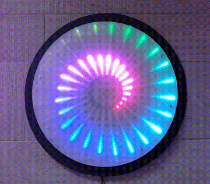
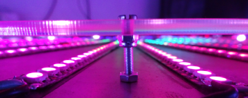
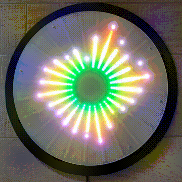
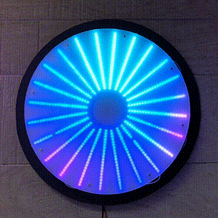
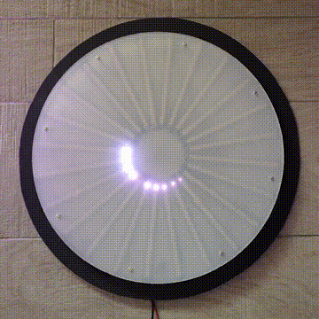

# Project Aureole
## A programmable circular LED display with 504 pixels.

**Aureole** is a programmable LED disc consisting or 24 arms each made up of 21 RGB LEDs. Powered by an Arduino ESP8266 and [Canvas Cast](https://github.com/owenmcateer/canvas-cast). Animations can be streamed over Wifi/USB or programmed directed on the Arduino.

If you'd like to know how it was built or build your own one, see my [build guide here](./how-to-build/README.md).

_**Aureole**: "A circle of light caused by the diffraction effect of light at tiny atmospheric droplets of the cloud."_

See some demos of what it can do below or check out my [Instagram (Motus Art)](https://www.instagram.com/motus_art/) for more.

## Audio graphic equalizer
  
I build this display with a graphic equalizer in mind. The 24 arms of LEDs to display 24 bands of frequency ranges with falloff, changing colours, patterns, whatever you can think of to bring music to life.   
The audio processing (FFT) is done on the computer playing the music in JavaScript using the WebAudio API, animated and sent using [Canvas Cast](https://github.com/owenmcateer/canvas-cast) to Aureole.  
[View source code](./graphic-equalizer/equalizer.js)

## Animations
  
An unusual shaped display is great for creating different types of animations, patterns and designs. Here are just a few, make sure to check my [Instagram (Motus Art)](https://www.instagram.com/motus_art/) where I post more animations regularly.  
[View source code](./animations/)

## Cryptocurrency ticker
  
A realtime visual feed of Cryptocurrency trading. Green=buy, Red=sell. The length and speed of each trade indicates it's size & priority. [Kraken](https://docs.kraken.com/websockets/) provides the realtime trading data WebSockets, JavaScript listens for trades and then animates them to Aureole. The white spinner indicates the feed connection is open and brings some life.  
[View source code](./crypto-ticker/crypto-ticker.js)

## Join my mailing list
Receive updates and info about new projects I'm working on. Subscribe to my [Mailing List](https://github.us17.list-manage.com/subscribe?u=c52203446e94cb797253d941c&id=6b37dd911e).