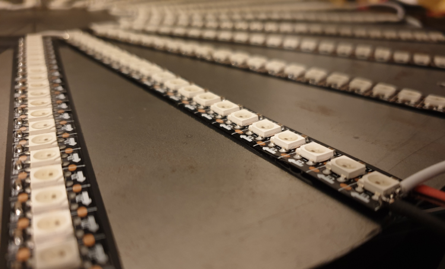
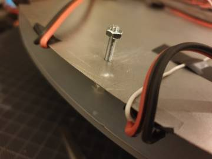
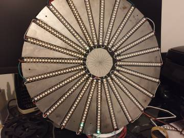
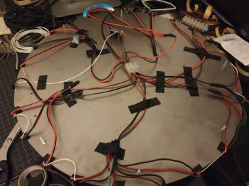
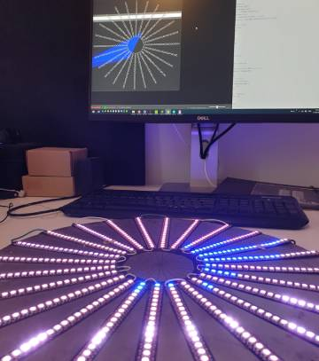
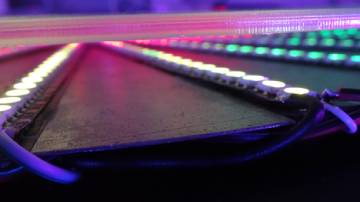
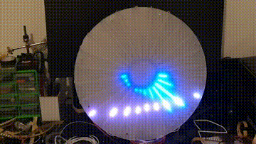

# Project Aureole
## Build instructions

## Build photos

Testing  

## Shopping list
* Metal disk 500mm diameter
* Frosted perspex, circular cut, 3mm x 500mm
* LEDs, WS2812B 144LEDs/m, 3.5-4 meters for 500+ pixels
* ESP8266 / Arduino + Wifi
* PSU 5V-16A

All parts can easily be sourced on eBay or Aliexpress.  
Total cost around *€150*